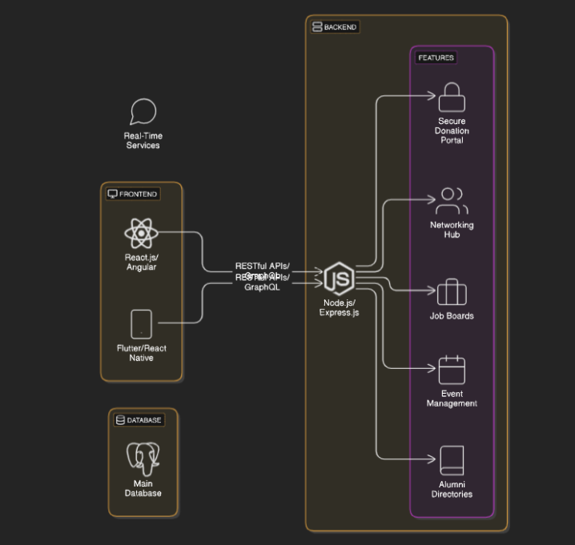
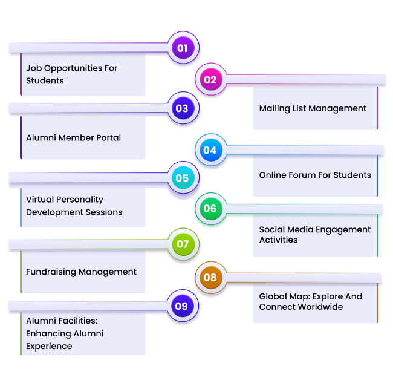

# Smart India Hackathon Workshop
# Date:01/12/2024
## Register Number:24001333
## Name:Tharunish vasan.T
## Problem Title
Implementation of the Alumni Association platform for the University/Institute.
## Problem Description
Background: Alumni associations play a pivotal role in fostering lifelong connections between graduates and their alma mater, facilitating networking, mentorship, and philanthropic support. However, many alumni associations face challenges in maintaining engagement, facilitating donations, and providing valuable services such as job networking and tracking alumni success stories. A comprehensive Alumni Association platform for a University/Institute, encompassing both web and mobile applications, aims to address these challenges effectively. Detailed Description: The proposed Alumni Association platform for the Government Engineering College will feature robust functionalities accessible through both web and mobile applications: Alumni Registration: User-friendly registration processes on both web and mobile platforms, allowing alumni to join the association, update their profiles, and stay connected with peers and the institution. Donation Portal: Secure mechanisms on both platforms for alumni to contribute donations easily and support various initiatives and projects undertaken by the college, fostering a culture of philanthropy. Networking Hub: Dedicated sections on both platforms to connect alumni based on shared interests, professions, and geographic locations, facilitating professional networking, mentorship, and collaboration opportunities. Job Portal: Integrated job search and posting features accessible via web and mobile apps, enabling alumni to explore career opportunities, post job openings, and connect with potential employers within the alumni network. Alumni Directory: Search functionalities available on both platforms to find alumni based on different criteria such as graduation year, field of study, industry, location, etc., promoting networking and community building. Success Story Tracking: Features on both web and mobile apps to showcase and track alumni achievements, success stories, and notable contributions to society, inspiring current students and fostering pride among alumni. Events and Reunions: Announcements, registrations, and management tools available on both platforms for organizing alumni events, reunions, workshops, and professional development sessions to maintain engagement and connection. Feedback and Surveys: Channels on both web and mobile apps for alumni to provide feedback on their experiences, suggest improvements, and participate in surveys to help shape future initiatives of the association. The platform will prioritize user experience, security, and scalability across both web and mobile applications to cater to the diverse needs of the Government Engineering College's alumni community. Expected Solution: Implementation of the Alumni Association platform for the Government Engineering College, comprising both web and mobile applications, is expected to achieve several positive outcomes: Enhanced Alumni Engagement: Seamless access to networking, career opportunities, and alumni events through web and mobile apps will strengthen connections among alumni, fostering a vibrant and active community. Increased Philanthropic Support: Convenient donation processes accessible via both platforms will encourage alumni to contribute towards the college's growth and development initiatives. Career Advancement: Access to job postings, mentorship opportunities, and professional networking on mobile devices will support alumni in their career growth and advancement. Knowledge Sharing: Exchange of knowledge, experiences, and best practices facilitated through both web and mobile apps will enrich professional development and lifelong learning initiatives. Pride and Recognition: Highlighting alumni achievements and success stories on both platforms will instill pride in the alma mater and inspire current students to excel in their academic and professional pursuits. Community Building: Interactive features available on both web and mobile apps will nurture a sense of belonging and camaraderie among alumni, strengthening their bond with the institution. In summary, the Alumni Association platform for the University/Institute, integrated with both web and mobile applications, aims to create a dynamic and supportive ecosystem where alumni can connect, contribute, and thrive, thereby enriching the overall educational experience and legacy of the institution.
## Problem Creater's Organization
Government of Gujarat

## Idea

This paragraph outlines the concept of developing a comprehensive Alumni Association platform for a Government Engineering College, featuring both web and mobile applications.The aim is to create a platform that makes strong connections between alumni and the institution, encouraging networking, mentorship, and contributions.This platform aims to build a strong, engaged alumni community while supporting the college's growth and reputation.By providing these services, the platform encourages engagement, career growth, and a culture of giving back, helping build a thriving alumni community.

Purpose of the platform:
                      1.Enhance alumni engagement and community building
                      2.Provide a range of services like networking, donations, job opportunities, and event management
                      3.It also made us to strengthen our Alumni Connections
                      4.Simplify the planning and management of alumni meetups, professional workshops, and reunions to strengthen the community bond

Core features:
              It also has many core features like Alumini Registration,donation portal,networking hub,job portal etc.. .Here are some core features

              1.Alumni Registration: Simple onboarding process with personalized profiles
              2.Donation Portal: Secure methods to contribute financially
              3.Job Portal: Job search and posting features to support career growth
              
Goal and benifits:
                 1.Enhanced Engagement: Keeping alumni connected with their alma mater and peers.
                 2.Increased Donations: Simplified processes to encourage giving back.
                 3.Career and Mentorship Opportunities: Support for professional growth and collaboration.

Implementation Focus:

                1.Both web and mobile applications are prioritized for accessibility and scalability.
                2.Emphasis on user experience, security, and ease of use.

Facilitating Networking Opportunities:

                1.Create a hub for professional networking, enabling alumni to collaborate, share knowledge, and support each other's career growth.
                2.A dedicated portal for alumni to share and access job opportunities within the alumni network.
                3.Partnerships with companies to post exclusive job openings for alumni and students.

## Proposed Solution / Architecture Diagram

## Use Cases

## Technology Stack
                1.React js

                2.Node js 

                3.MongoDB

                4.PostgreSQL 

                5.Git 

                6.Postman

## Dependencies
                1.Mapping service- 10 days

                2.Data collection- 10 days

                3.budget- rs.50,000

